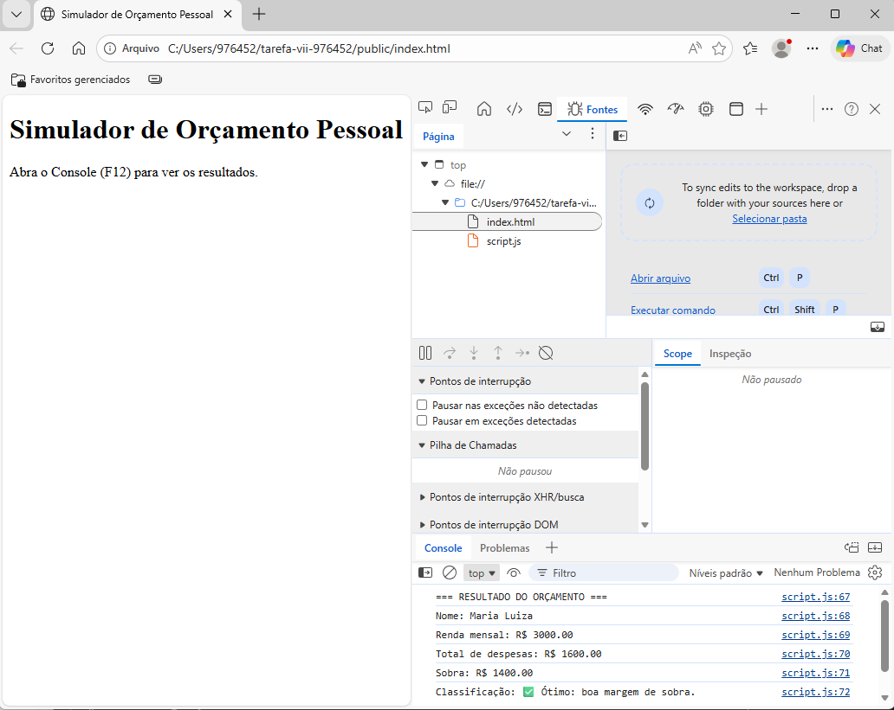

# Atividade Prática - JavaScript básico

## Aluna
**Nome:** Maria Luiza Aparecida Trindade de Meneses  
**Matrícula:** 976452

## Descrição
Este projeto implementa um simulador simples de orçamento pessoal em JavaScript.

## Arquivos do projeto
- public/index.html
- public/script.js

## Print da execução no Console
